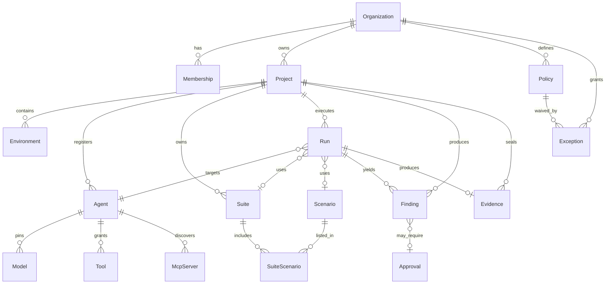

# Entity Relationship Diagram (Product Core)

## Tenancy key

All tenant-owned tables include `organization_id UUID NOT NULL`.
Project-scoped tables also include `project_id UUID NOT NULL`.
RLS policies enforce `organization_id = current_setting('app.organization_id')::uuid`.
